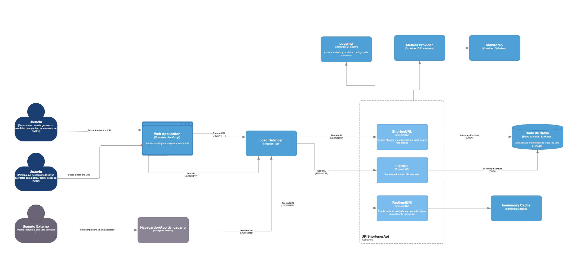

# Diseño de la Arquitectura

Considerando que la solución debe cumplir los siguiente requerimientos:

Funcionales:

- Las urls deben tener vigencia indefinida
- Las url deben poder ser administradas:
  - Habilitar o desahibilitar
  - Modificar url de destino (cualquiera de sus componentes).

No Funcionales:

- La plataforma debe soportar un tráfico de alrededor 1M RPM.
- Debe contar con estadísticas de acceso nearly real time.
- La resolución de urls debe ser lo más rápido posible y con el menor costo.

Además de la arquitectura base identificada mediante el tech discovery, se propone el siguiente diagrama para la solución.

## Principales Características

### Usuarios

Se considera que la solución tendrá 2 tipos de usuarios diferentes:

- Usuario interno: Pertenetencientes a la organización que desean generar una URL acortada y/o editarla para poder agregarla a una campaña de Twitter. Para este usuario se toma el suspuesto que no necesariamente tiene un perfil técnico y una interfaz web que le permita interactuar con la API mejoraría mucho su experiencia.

- Usuario Externo: Personas externa que intenta abrir ingresar a una URL acortada.

### Balanceador de Carga

Si el servicio espera tener un 99,98% de uptime entonces es altamente recomendable tener replicas en distintos clusters (al menos 1 replica en 2 cluster diferentes). De esta forma, si hay problemas con una de las regiones puede seguir funcionando la otra.En consecuencia, se necesita implementar un balanceador de carga que redireccione todas las peticiones entre los 2 clusters que están disponibles.

### API

Tendrá disponible 3 endpoints para cumplir con los requerimientos funcionales del servicio. Además dadas las herramientas disponibles en la organización se sugiere que sea construida en GO.

### Base de Datos

Se necesita conexión a base de datos para almacenar la información de todas las url acortadas que se vayan generando. Se necesita al menos guardar la información de

- Url
- clave de URL
- Estado

Considerando que se espera una gran volumetría de request por segundo y que se necestia una base de datos de alta performance se prefiere utilizar una base de datos NoSql.

### Caché

Permitíra aplicar 80/20 para almacenamiento de las peticiones de redirección y así ofrecer mejores tiempo de repuesta a nuestros usuarios. Normalmente el estandar para este tipo de implementaciones es usar Redis

### Metricas nearly real time

Para ello se necesita la implemetación un sistema dedicado a monitorear y que facilite la gestión de Alertas en caso de comportamientos anómalos, seguido de una herramienta que permita crear dashboards en tiempo real. Una buena forma de solventar esto es con la implementación conjunta de Prometheus + Grafana.

### Gestión de Logs

Necesaria para poder hacer análisis sobre posibles fallos del servicio.

## Consideraciones

La selección de tecnologías para cada parte depende en gran medida de la nube y herramientas disponibles dentro de la misma organización, por eso hay algunas secciones que no nombran ningun tipo de tecnología y solo tienen ejemplos de algunas. En otros caso sale indicada porque corresponde al estandar más utilizado actualmente y asumo que están disponibles dentro de la organización 